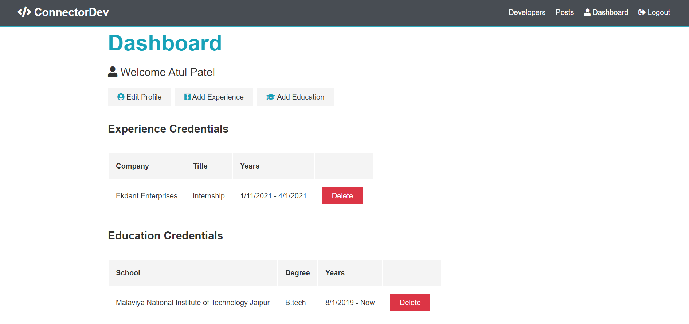

Live Site - https://protected-ravine-38980.herokuapp.com/

It is a  social network app , where all the developers can post and get help from the other developers.
This project is made using MERN Stack and Created an extensive backend API with Express and testing with postman,
integrated React with Express using React Hooks and Async/Await practices,
used stateless JWT authentication and Redux for state management , and
deployed on Heroku.

